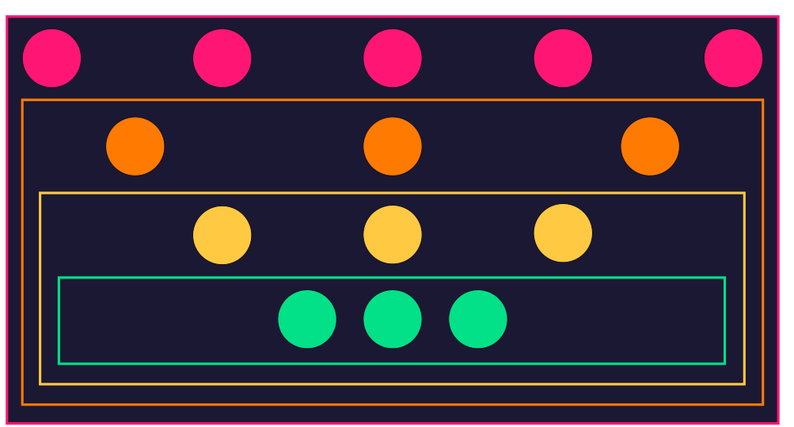
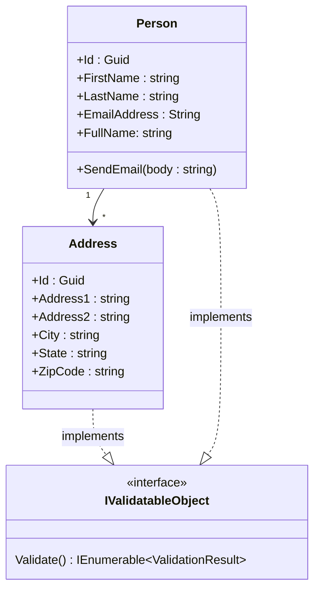
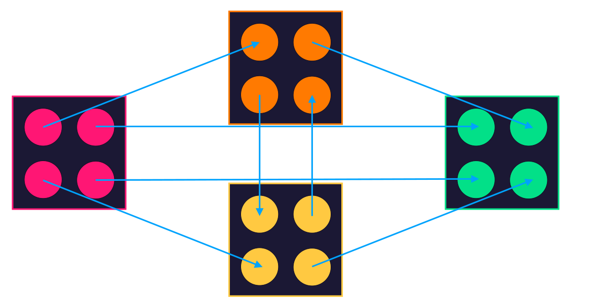
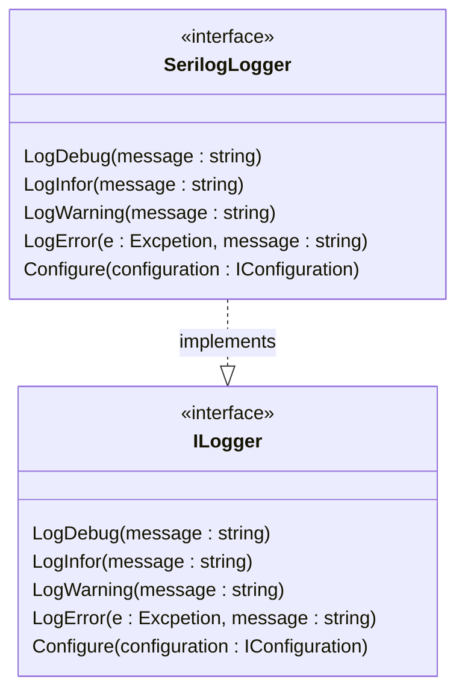

# Four pillars of OOP

# Abstraction

Don't need to know how the classes works internally

- Implementation Hiding

# encapsulation

Don't need to know what other classes know.

- Data Hiding

# Inheritance

A Family Tree
ex: a dog is a mammal, a lizard is a reptile both are animals
- Object Taxonomy

# Polymorphism

A method takes an animal will gladly accept a dog or a lizard.
- Object Interchangeability

# SOLID principles

Important principles of object-oriented design.

S - Single Responsibility Principle

A module should have a well defined job.

O - Open-Close Principle

you should provide extension points for customization

L - Liskov Substitution Principle

essentially polymorphism

I - Interface Segregation Principle

you should divide off multiple task-specific interfaces.

D - Dependency Inversion Principle

Don't tie your self to specific implementations

Notes on SOLID

each of the solid principles maps to one or more pillars of OOP.

if we design principles this in mind they gently steer you in right direction to write better
more maintainable code.

Other key phrases 

Cohesion
coupling
Orthogonality

this are abstract terms, They are essentially the same way to define the core concepts.

but looking at it different angles.

# Cohesion

describes how related code is in a particular module.

cohesion in
* single method
* class
* namespace
* entire project
* solution

cohesion refers to has how well the elements at that level focused on the single concept.

// if we want full name, we will add fullname rather than adding it all over the project.
// fullname is internally cohesive since fullname is perfectly fine for person class.
+FullName : string

Address class is only concern with address stuff.

Person class is only concern with Person stuff.

A Person may have an address it's not who they are.

Example

`
    It's better to have multiple smaller Cohesion class than to have few larger classes with low cohesion
`

# Coupling

coupling measures how one class or an object depend on another.

problem : 
changes in dependency can bubble up and requires changes in the consumers.

Tight coupling
loss coupling 

example : 

mutliple logger can implment ILogger interface.

decopuling requirments from it's implementation.

wehen we want to log something we only need instance of ILogger interface.

# Nouns, Verbs, Adjectives, and Entities

Nonuns = Class

Includes entities such as Customer, Order, and Product
Also includes non-entity objects like loggers, controllers, and messages

Vers = Methods

The things your classes can do, both to itself or to other object

Adjectives = Interfaces

Abstract capabilities that an object has, composed of its methods and properties combined

