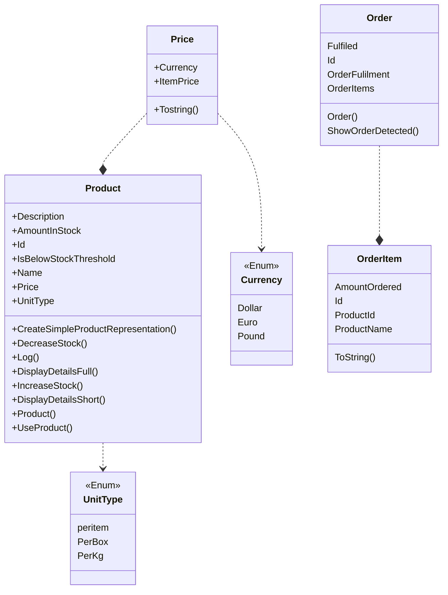

# Identifying the classes and their functionalities

* Product class data

Product class functtionalites

“Use” product
Add new product to inventory
Alert if low on stock
Display the details of a product (short & long)
Increase stock when order arrives

* Order class data
Order class functtionalites
Show details of order and order lines

