Encapsulation

Inheritance

Polymorphism

Abstraction


--

Extra 


coupling

composition

cohesion

abstractions

instantiation

Orthogonality


---
# Define a class

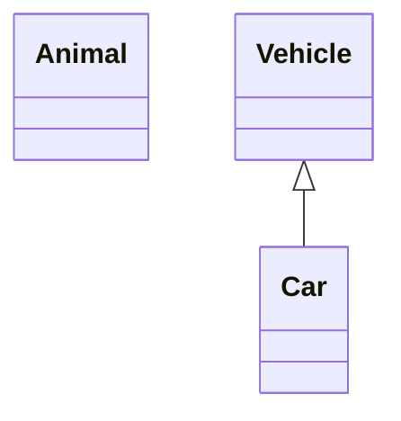

# class labels
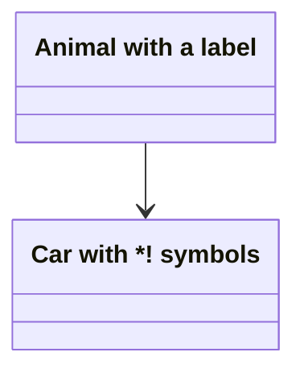

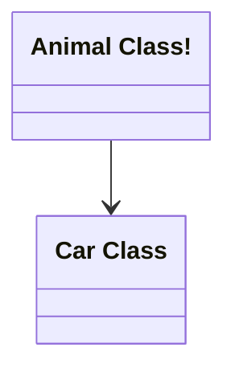

# Defining Members of a class

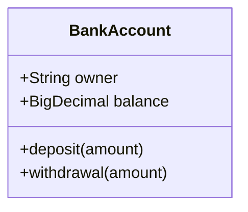

**Code Example**

we can use code syntax.


--- 

**Return Type**

added bool and int return type to methods

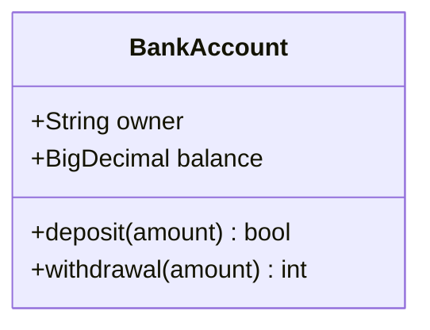

**Generic Types**

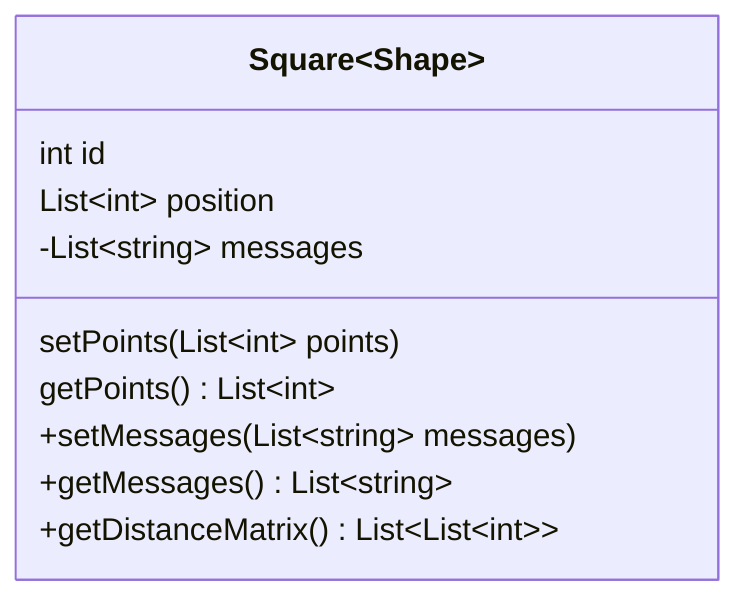

# Defining Relationship

[classA][Arrow][ClassB]

Type	Description
<|--	Inheritance

*--	Composition

o--	Aggregation

-->	Association

--	Link (Solid)

..>	Dependency

..|>	Realization

..	Link (Dashed)


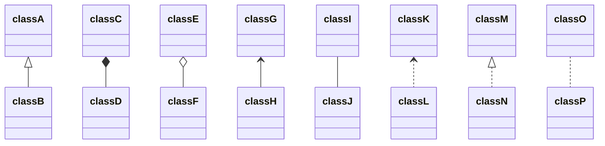

**with lables**

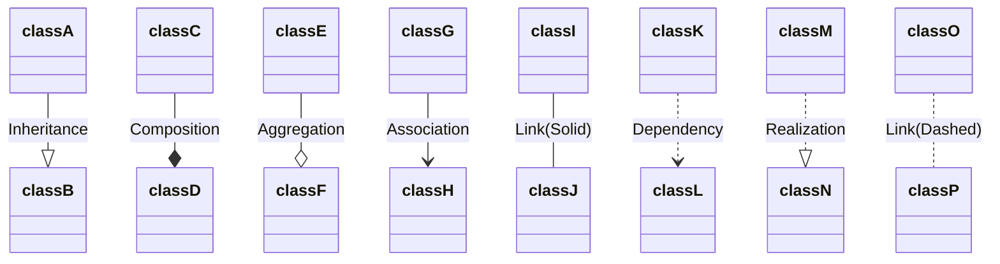

*label on relationship**

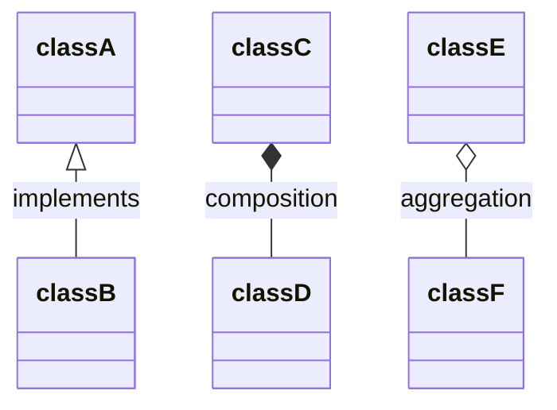

# Two way relations

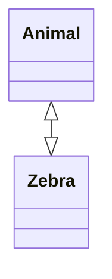

[Relation Type][Link][Relation Type]

Type	Description
<|	Inheritance

\*	Composition

o	Aggregation

>	Association

<	Association

|>	Realization

Type	Description

--	Solid

..	Dashed


**Lollipop Interfaces**

bar ()-- foo

foo --() bar


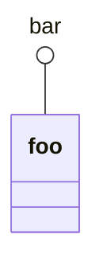

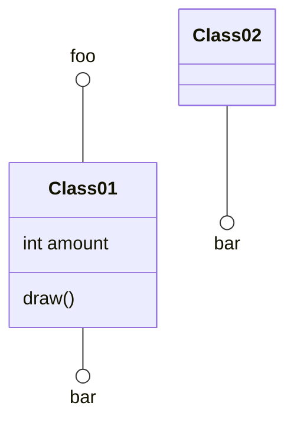

# Define Namespace

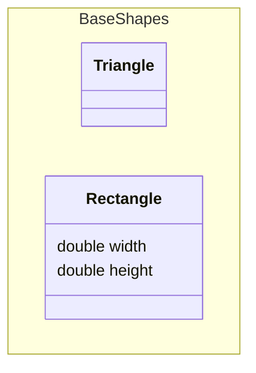

# Cardinality / Multiplicity on relations

[classA] "cardinality1" [Arrow] "cardinality2" [ClassB]:LabelText

Multiplicity notations are placed near the end of an association.

The different cardinality options are :

1 Only 1

0..1 Zero or One

1..* One or more

* Many

n n (where n>1)

0..n zero to n (where n>1)

1..n one to n (where n>1)


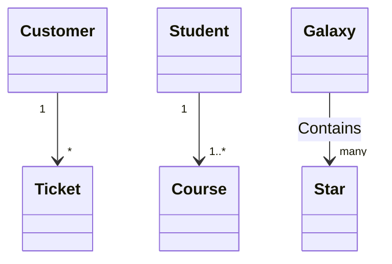

# Annotations on classes

<<Interface>> To represent an Interface class

<<Abstract>> To represent an abstract class

<<Service>> To represent a service class

<<Enumeration>> To represent an enum

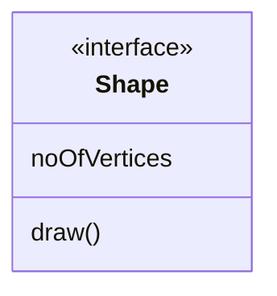

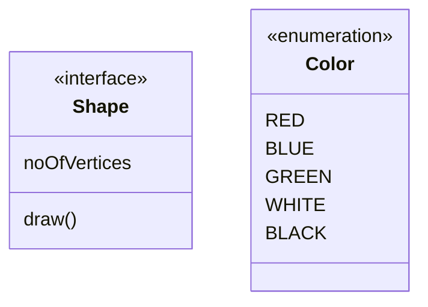


# Comments


# Setting the direction of the diagram

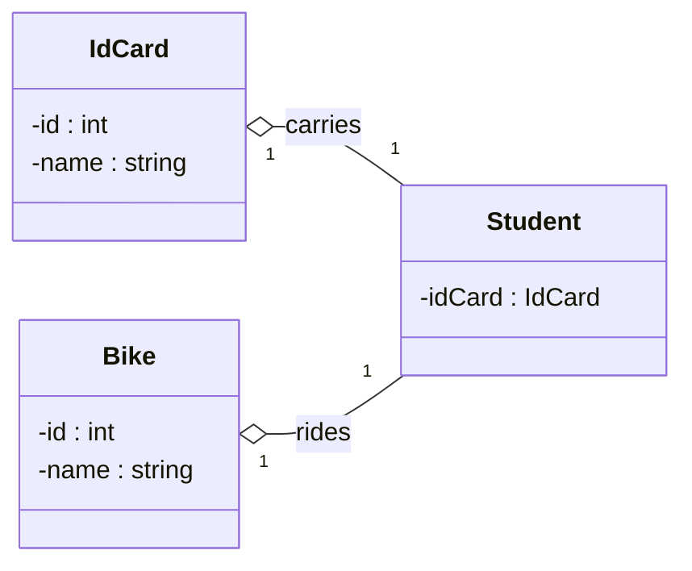


# Interaction

something i might not use but it got it i don't know why i have this.

action className "reference" "tooltip"

click className call callback() "tooltip"

click className href "url" "tooltip"


```mermaid

```

# Notes

```mermaid
classDiagram
    note "This is a general note"
    note for MyClass "This is a note for a class"
    class MyClass{
    }
```

**url link**
```mermaid
classDiagram
class Shape
link Shape "https://www.github.com" "This is a tooltip for a link"
class Shape2
click Shape2 href "https://www.github.com" "This is a tooltip for a link"
```

**callback**
```mermaid
classDiagram
class Shape
callback Shape "callbackFunction" "This is a tooltip for a callback"
class Shape2
click Shape2 call callbackFunction() "This is a tooltip for a callback"
```
the script below is linked.

```js
<script>
  const callbackFunction = function () {
    alert('A callback was triggered');
  };
</script>
```

```mermaid
classDiagram
    class Class01
    class Class02
    callback Class01 "callbackFunction" "Callback tooltip"
    link Class02 "https://www.github.com" "This is a link"
    class Class03
    class Class04
    click Class03 call callbackFunction() "Callback tooltip"
    click Class04 href "https://www.github.com" "This is a link"
```


```html
<body>
  <pre class="mermaid">
    classDiagram
    Animal <|-- Duck
    Animal <|-- Fish
    Animal <|-- Zebra
    Animal : +int age
    Animal : +String gender
    Animal: +isMammal()
    Animal: +mate()
    class Duck{
      +String beakColor
      +swim()
      +quack()
      }
    class Fish{
      -int sizeInFeet
      -canEat()
      }
    class Zebra{
      +bool is_wild
      +run()
      }

      callback Duck callback "Tooltip"
      link Zebra "https://www.github.com" "This is a link"
  </pre>

  <script>
    const callback = function () {
      alert('A callback was triggered');
    };
    const config = {
      startOnLoad: true,
      securityLevel: 'loose',
    };
    mermaid.initialize(config);
  </script>
</body>
```

# styling

styling a node

```mermaid
classDiagram
  class Animal
  class Mineral
  style Animal fill:#f9f,stroke:#333,stroke-width:4px
  style Mineral fill:#bbf,stroke:#f66,stroke-width:2px,color:#fff,stroke-dasharray: 5 5
```


```mermaid
classDiagram
    class Animal:::someclass
    classDef someclass fill:#f96
```

```mermaid
classDiagram
    class Animal:::someclass {
        -int sizeInFeet
        -canEat()
    }
    classDef someclass fill:#f96

```

